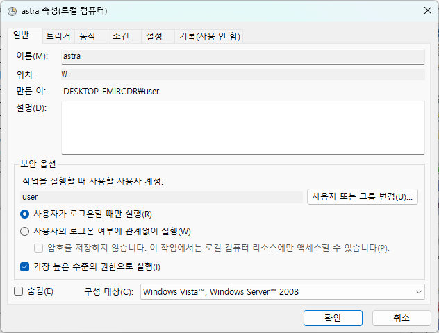
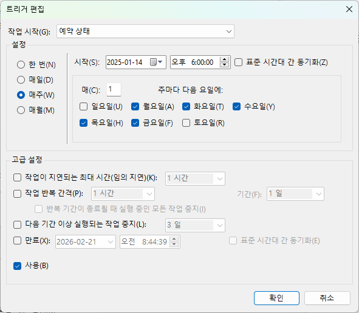
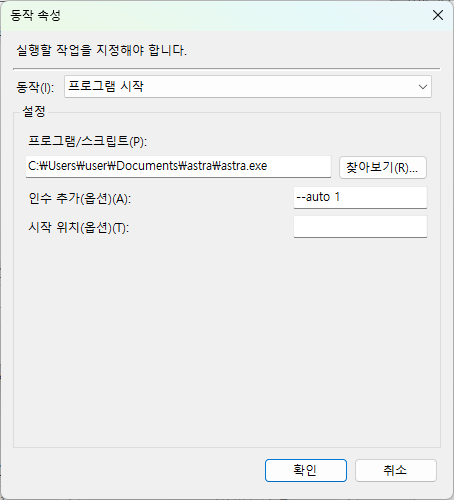

# ✨ 자동 모드

## 작업 스케줄러
정해진 시간에 자동으로 주문을 실행하게 하려면 작업 스케줄러를 사용해야 합니다.

작업스케줄러에 익숙하지 않으면 아래 블로그를 참고하시기 바랍니다.

[윈도우 작업 스케줄러 통해 프로그램 자동 실행하기](https://blog.naver.com/whitehotdog/223134547879)

## 작업 스케줄러 세팅
### 일반
프로그램에서 HTS를 제어하려면 관리자 권한이 필요하므로 `가장 높은 수준의 권한으로 실행`을 체크해야 합니다.

### 트리거
주식시장이 운영하는 매주 왈화수목금을 선택합니다.

### 동작
프로그램 항목에는 Astra를 설치한 경로를 입력합니다.

인수 추가 항목에는 다음과 같이 입력합니다. 
!!! note "인수 추가"
    --auto 슬롯번호

여러 개의 슬롯을 순차적으로 실행하고 싶을 때는 다음과 같이 콤마(,)로 구분해서 입력합니다.
!!! note ""
    --auto 1,3,4

!!! warning "주의"
    매매가 가능한 시간에 실행을 해야하며, 가급적 빨리 주문하는 게 좋습니다. 사례를 보면 LOC 거래는 선착순이 적용되는 걸로 보입니다.
