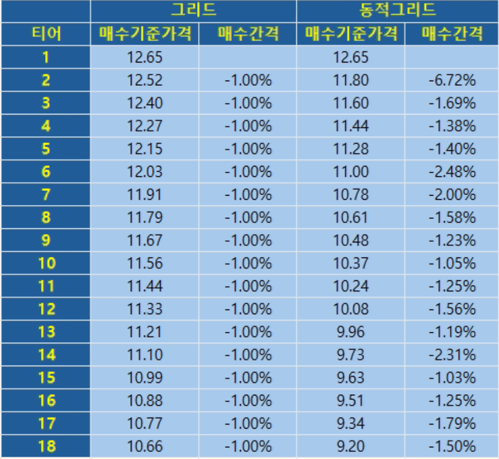
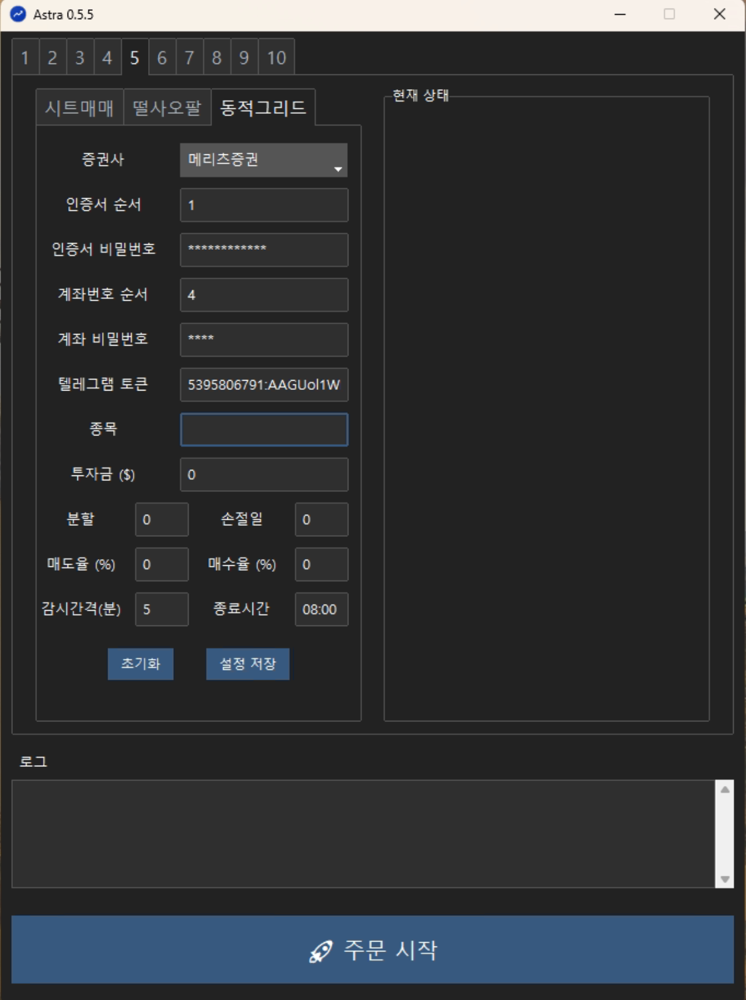

# 📈 동적그리드

## 매매법 설명

### 개요

그리드 매매법은 주가의 장중 변동성을 활용해 수익을 추구하는 전략으로, 일정한 조건이 충족되면 자동으로 주문이 실행되도록 설계된 자동매매에 특화된 방식입니다.

하지만 다음과 같은 한계도 가지고 있습니다.

- **시드 소진**  
  하락장에서 빠르게 시드가 소진되어 이후 매매가 불가능한 '냉동 상태'가 발생할 수 있습니다.

- **무손절 구조**  
  손절 기준이 없기 때문에 상위 티어는 고점 매수 상태로 지속적인 손실을 기록합니다.

**동적 그리드** 매매법은 기존 그리드 매매법의 한계를 보완하기 위해 **종가 매매 전략**(예: *떨사오팔*, *종사종팔*, *동적파도타기*, *4989* 등)을 접목한 방법입니다.

### 동적 그리드 특징

1. **N일 손절 규칙**  
   일정 기간 내 회복하지 못한 티어는 자동으로 손절 처리합니다. 종가 매매 기법에서 힌트를 얻었습니다.

2. **감시마다 1매수 원칙**  
   감시 시점마다 매수는 현재가로 1회만 발생하므로 급락 상황에서 다수의 티어가 동시에 매수되는 현상을 방지합니다. 종가 매매 기법의 *'1일 1매수 원칙'*을 적용했습니다.

3. **동적 매수/매도 테이블 구성**  
   2번 특징으로 인해서 기존 그리드처럼 고정된 매수/매도 테이블이 아닌, 주가 흐름에 따라 유동적인 매매 기준 가격을 생성합니다. 이러한 특성 때문에 '동적 그리드'라는 이름을 붙였습니다.

### 동적 그리드 효과
매수 간격을 -1% 로 설정했을 때, 기존 그리드는 티어간 동일한 간격을 가지는데 반해서 동적그리드는 상황에 따라 가변적인 간격을 가지게 됩니다. 아래 예시는 실제 동적그리드를 실행해서 생성된 테이블입니다.

{: style="width:450px; display:block; margin:0 auto"}
/// caption
기존 그리드 vs 동적 그리드
///

V자 반등이 일어나는 경우에는 기존 그리드가 더 유리할 수 있고 (많은 티어를 매수 후 바로 매도가 일어나게 되므로) 동적그리드는 하방 커버가 더 넒으므로 하락장 대처에 유리합니다. 

그리고 손절 규칙이 있기 때문에 냉동 상태를 방지할 수 있고 기존 그리드 방법보다 더 적은 티어로 운용이 가능합니다.

## 사용 방법
### 1. 설정
{: style="width:600px; display:block; margin:0 auto"}

|설정|설명|
|---|---|
| 종목| 티커 이름을 입력합니다.|
| 투자금| 초기 투자 금액을 달러 단위로 입력합니다.|
| 분할| 투자금액을 분할할 개수를 입력합니다. 분할이 작으면 매도마다 수익이 높은 반면 시드가 빠르게 소진되고, 분할이 크면 매도마다 수익은 적지만 하방 커버가 늘어납니다.|
| 손절일| 매수 후 며칠 동안 매도가 되지 않으면 손절할 날짜 수를 입력합니다. 주식 시장이 열리는 날을 기준으로 계산이 되며, 사용자가 프로그램을 실행하지 않은 날은 손절일 계산에서 제외됩니다.|
| 매도율| 매수 가격에서 최소 몇 퍼센트 상승할 때 매도할 지 결정합니다.|
| 매수율| 매수 가격에서 최소 몇 퍼센트 하락할 때 다음 티어를 매수할 지 결정합니다.|
| 감시간격| 몇 분 마다 감시를 할 지에 대한 설정입니다. `0`을 입력하면 대기시간 없이 감시를 수행합니다.|
| 종료시간| 감시를 종료할 시간입니다. `HH:MM`형식으로 입력합니다.|

설정을 입력한 후 "**설정 저장**" 버튼을 클릭합니다.

!!! note "설정 저장"
    설정을 변경하면 꼭 설정 저장 버튼을 눌러야 변경된 정보가 반영이 됩니다.

!!! warning "최적화 설정"
    그리드 매매의 특성상 백테스트가 불가능하므로 최적의 설정은 알 수 없습니다. 사용자의 직관과 투자 성향에 따라 적절히 설정해서 사용하시기 바랍니다.

### 2. 주문하기
주문 시작 버튼을 누르면 주문이 시작됩니다.

다음과 같은 순서로 진행이 됩니다.

1. HTS 실행
2. 반복 실행
      1. 이전 주문 체결 확인 및 티어 조정
      2. 보유 수량이 없는 경우에 현재 가격으로 1티어 매수 주문
      2. 현재 가격이 티어들의 매도가 보다 높은 경우에 매도 주문 (조건을 만족하는 여러 티어 동시 주문)
      3. 현재 가격이 다음 티어의 매수가 보다 낮은 경우에 매수 주문 (한 개 티어 주문)
      4. 현재 상태 (현재 티어, 현재가, 매수가, 매도가) 텔레그램 메시지 전송
      5. 다음 번 감시가 종료 시간을 넘어가는 경우에 종료
3. 정산 텔레그램 메시지 전송 후 종료

!!! warning "키보드 마우스 동작 금지"
    주문 동작이 일어나는 동안 마우스나 키보드를 움직이면 문제가 생길 수 있으니 주의바랍니다.

!!! warning "작업 스케줄러 멀티 슬롯 시용"
    동적 그리드는 끝나지 않고 계속 실행이 되기 때문에, 작업 스케줄러를 통해서 멀티 슬롯을 사용할 때는 가장 마지막 순서에 넣어야 합니다.

### 3. (필요한 경우) 현재 상태 수정
현재 상태가 `%USERPROFILE%\\.astra\dynamic_grid_{슬롯번호}.csv` 파일에 저장이 됩니다. 엑셀을 사용해서 확인 및 편집이 가능하고, 엑셀이 설치되어 있지 않더라도 메모장에서 열어서 확인이 가능합니다. 
