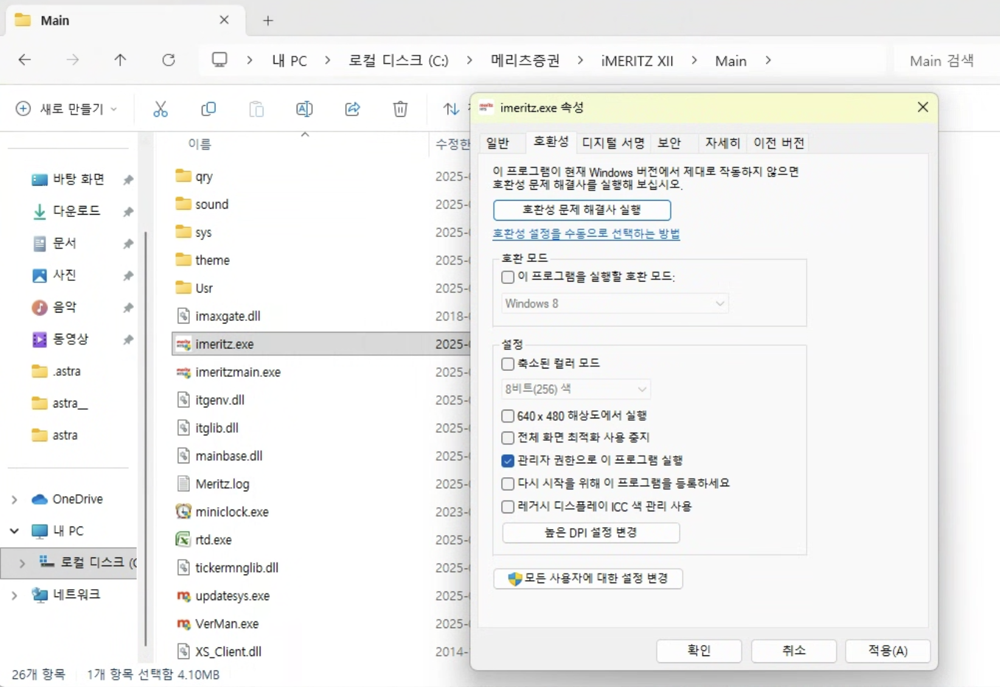
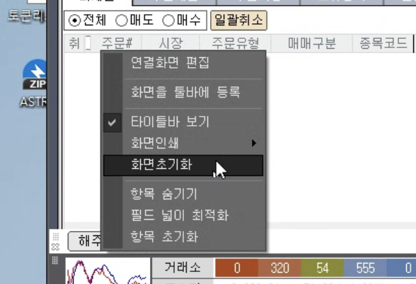

# 📌 자주 묻는 질문

??? note "새 버전을 설치하면 설정을 다시 해야할까요?"
    설정은 사용자 계정 경로(%userprofile%\\.astra)에 저장하고 있으므로, 설정을 다시할 필요는 없습니다.

??? note ""텔레그램 봇과 통신을 실패했습니다. 봇에 메시지를 보낸 후 다시 설정 저장 버튼을 눌러주세요" 에러가 발생합니다."
    생성한 텔레그램 봇이 활성화 되지 않아서 발생하는 오류입니다.

    1. 텔레그램 봇 채팅 화면을 열어서 메시지를 보냅니다. (어떤 메시지든 상관없습니다.)
    2. Astra 에서 다시 "설정 저장" 버튼을 누릅니다.
    3. 정상적으로 인식이 되면, 텔레그램 봇에 "텔레그램 동작확인" 메시지가 보내집니다.

??? note "could not convert to string to float: '$12.34' 에러가 발생합니다" 
    시트 주문표에서 가격 입력하는 셀에 달러($) 기호가 포함되어 있으면 해당 에러가 발생할 수 있습니다. 달러 기호를 제거하고 다시 시도해 보세요.

??? note "새 버전이 나오면 매번 설치해야 할까요?"
    아닙니다. 새 버전에서 업데이트된 내용을 확인한 다음에 필요한 기능이거나 본인한테 발생하는 문제점이 수정된 경우에만 업데이트 하면 됩니다.

??? note ""[로그인]통신 초기화에 실패 하였습니다.[-100]" 오류가 발생합니다."
    다양한 원인에 의해서 발생할 수 있습니다. 아래의 방법들을 시도해 보시기 바랍니다.

    1. 백신 프로그램(특히 Ahnlab Safe Transaction)에서 매크로 프로그램을 감지해서 막는 경우가 있습니다. 백신을 종료하신 다음에 시도해 보세요.
    2. 와이파이 신호가 불안정할 때 발생할 수 있습니다. 유선랜으로 바꾸고 시도해 보세요.
    3. HTS를 관리자 모드로 실행하면 해결되는 경우가 있습니다.
        1. 파일 탐색기를 열어서 `내 PC > C: > 메리츠증권 > iMeritz XII > Main` 으로 이동합니다.
        2. `imeritz.exe` 에서 마우스 오른쪽 클릭 > 속성 클릭
        3. 호환성 탭에서 `관리자 권한으로 이 프로그램 실행` 체크 후 확인
        

??? note "주문 취소가 동작 안해요"
    주문 취소 기능은 해외주식주문창 미체결 탭에서 이루어지게 되는데 화면 구성이 변경된 경우에 주문 취소 기능이 제대로 동작 안하는 경우가 있습니다.
    그 때는 아래처럼 마우스 오른쪽 클릭 > 화면 초기화를 하면 정상 동작하게 됩니다. (쪼꼬야옹님 제공)
    

   