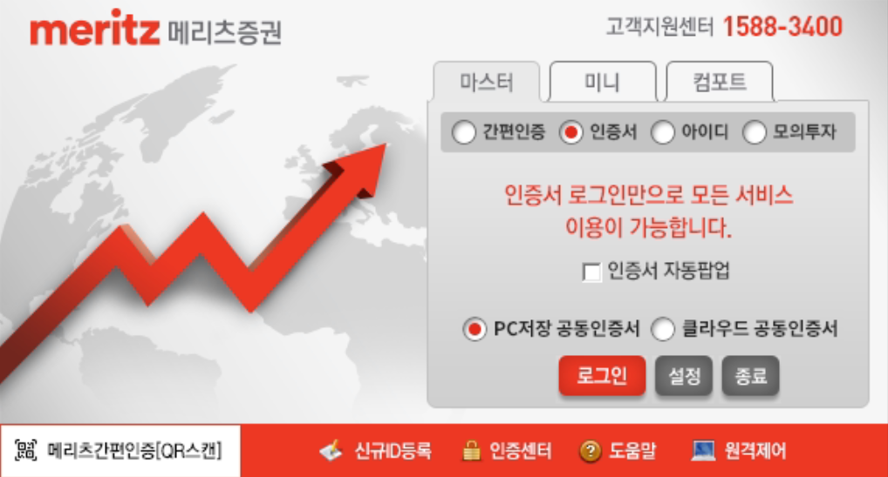
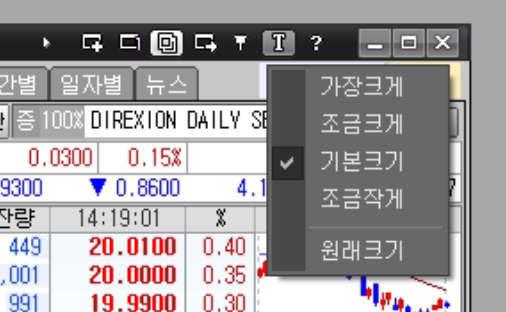

# 🇲 메리츠증권

- 마스터, 미니, 컴포트 모드 중에서 마스터 모드로 사용해야 합니다.
  
- 클라우드 공인인증서는 지원하지 않으므로 하드디스크 공인인증서를 사용해야 합니다. 메리츠증권에서 신규 발급은 클라우드 인증서만 가능하므로 타 증권사에서 발급후 타기관 인증서 등록을 해서 사용합니다.
- 설정 > 보기 > 화면제어바 체크
- [6100] 해외주식 주문 > 미체결 > 일괄취소 누르면 나오는 주문취소 창에서 "자동창닫기" 체크 해제
- [6100] 해외주식 주문 창에서 글꼴크기를 기본크기로 설정
  
- 기타 다른 설정들도 초기값으로 사용해야 오류 발생 가능성이 낮아집니다.
- 어떤 설정을 수정했는지 잘 모른다면, 설정 초기화하는 방법이 좋으며 그래도 에러가 계속 발생하면 HTS 를 삭제하고 재설치하는 것이 도움이 될 수도 있습니다.
