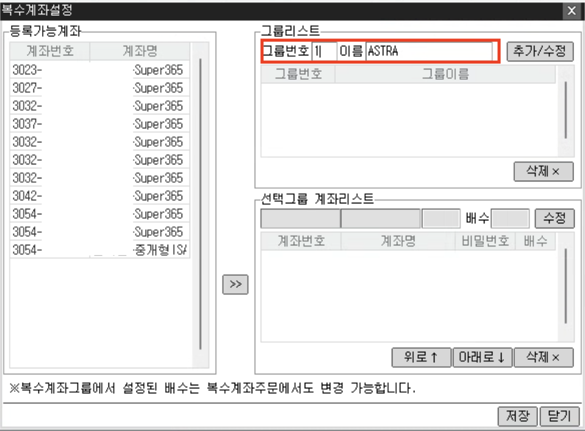
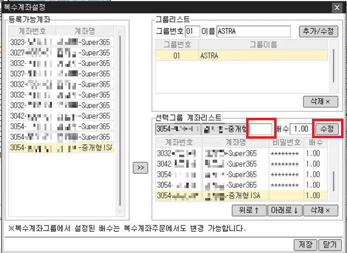

# 🇲 메리츠증권 국장 설정

## 계좌그룹 등록
ISA 계좌를 지원하기 위해서 계좌그룹 등록이 필요합니다. ISA 계좌가 없더라도 이 과정을 필수로 진행해야 합니다.
이미 계좌그룹을 사용하고 있는 경우에는 ASTRA에서 사용하는 그룹을 가장 처음에 표시 되도록 합니다.
!!! warning
    주문 창에 출력되는 계좌 순서와 계좌그룹에 등록되는 계좌 순서가 일치해야 합니다. 

    일치하지 않을 경우 오동작할 수 있으니 주의바랍니다.

1. [2063] 주식 복수계좌 예수금 창에서 그룹등록/조회 버튼을 클릭합니다.

2. 그룹리스트에서 그룹번호에 `1` 이름에 `ASTRA` 를 입력 후 추가/수정 버튼을 클릭합니다.

3. 계좌를 선택한 후 화살표 버튼을 클릭해서 선택그룹 계좌리스트에 모든 계좌를 추가합니다. 계좌마다 비밀번호 입력 후 수정 버튼을 클릭합니다.

4. 저장 버튼을 클릭합니다.
5. 주문 창에 출력되는 계좌 순서와 동일한 지 확인합니다.

## 종목 이름 입력 방법
종목 이름이 알파벳으로 구성되어 있으면 미국장 종목으로 숫자로 이루어져 있으면 한국장 종목으로 인식합니다.
삼성전자인 경우 숫자로된 종목 번호인 005930을 입력합니다.

## 시트매매 주문타입
시트매매에서 다음의 주문타입을 지원합니다.

- 시장가
- 지정가
- 장전 시간외종가
- 장후 시간외종가