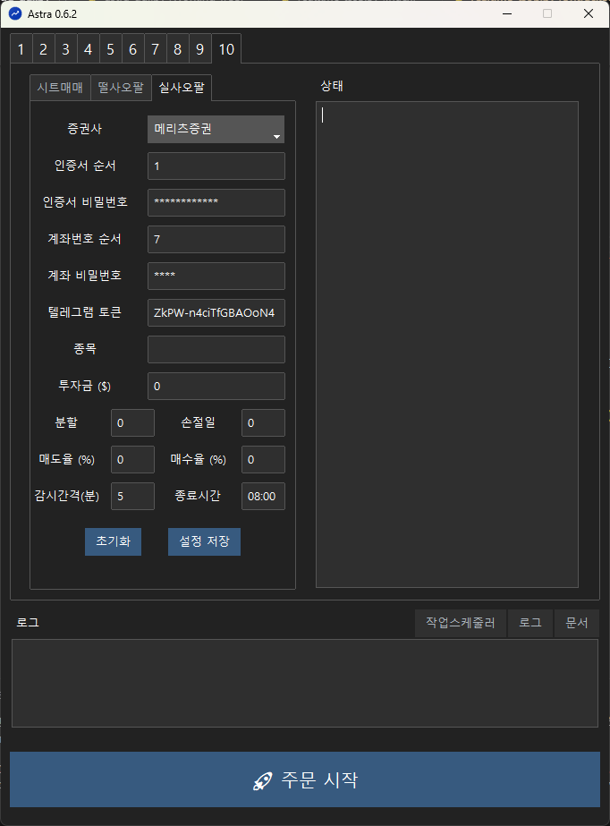

# 📈 실시간 떨사오팔 (실사오팔)

## 매매법 설명

### 개요

실사오팔은 기존 '떨사오팔' 전략을 실시간으로 확장한 자동 주식 매매 전략입니다. 하루 한 번 종가 기준으로만 거래하던 기존 방식과 달리, **정해진 시간 주기(예: 5분)**마다 가격을 감시하고 장중 변동성에 즉각적인 반응으로 매매를 실행합니다. 실시간 주문 기준은 그리드(혹은 아바타) 방법을 참고했습니다.

### 떨사오팔과 차이점
|항목|떨사오팔|실사오팔|
|---|------|-----|
| 거래 시점 | 1일 1회 장마감시                   | 장중 실시간 (N분마다 감시)|
| 매수 기준 | 전일 종가 대비 매수율 이상 하락 시      | 1. 보유한 마지막 티어 매수가격 대비 매수율 이상 하락 시  2. 보유 티어가 없는 경우에는 감시 시점 현재가로 1티어 매수|
| 매도 기준 | 티어 별 매수 가격에서 매도율 이상 상승 시 | 동일 |
| 주문 방식 | LOC | 현재 가격으로 지정가 주문 |

### 장점
- 장중 변동성이 큰 경우에 거래가 많이 이루어지므로 추가 수익이 가능합니다.
- 장 마감 후 애프터장에도 운용이 가능합니다.
- 보유 티어가 없으면 현재가로 1티어를 매수하므로 상승장에서 수익이 가능합니다. (떨사오팔은 보유 티어 없이 상승만 하는 경우 거래가 이루어지지 않음)
 
### 단점
- 하루에 여러 번 거래가 발생하므로 기존 방법 대비 더 많은 분할 수가 필요합니다. 분할 마다 시드 금액이 작으므로 장중 변동성이 크지 않은 상황에서는 기존 방법보다 수익이 낮아집니다. 

## 사용 방법
### 1. 설정
{: style="width:600px; display:block; margin:0 auto"}

|설정|설명|
|---|---|
| 종목| 티커 이름을 입력합니다.|
| 투자금| 초기 투자 금액을 달러 단위로 입력합니다.|
| 분할| 투자금액을 분할할 개수를 입력합니다. 분할이 작으면 매도마다 수익이 높은 반면 시드가 빠르게 소진되고, 분할이 크면 매도마다 수익은 적지만 하방 커버가 늘어납니다.|
| 손절일| 매수 후 며칠 동안 매도가 되지 않으면 손절할 날짜 수를 입력합니다. 주식 시장이 열리는 날을 기준으로 계산이 되며, 사용자가 프로그램을 실행하지 않은 날은 손절일 계산에서 제외됩니다.|
| 매도율| 매수 가격에서 최소 몇 퍼센트 상승할 때 매도할 지 결정합니다. (예) 1% 상승시 매도할 경우 `1` 입력|
| 매수율| 매수 가격에서 최소 몇 퍼센트 하락할 때 다음 티어를 매수할 지 결정합니다. (예) 0.5% 하락시 매수할 경우 `-0.5`입력|
| 감시간격| 몇 분 마다 감시를 할 지에 대한 설정입니다. `0`을 입력하면 대기시간 없이 감시를 수행합니다.|
| 종료시간| 감시를 종료할 시간입니다. `HH:MM`형식으로 입력합니다.|

설정을 입력한 후 "**설정 저장**" 버튼을 클릭합니다.

!!! note "설정 저장"
    설정을 변경하면 꼭 설정 저장 버튼을 눌러야 변경된 정보가 반영이 됩니다.

!!! warning "최적화 설정"
    실시간 감시 주문을 하기 때문에 백테스트가 불가능하므로 최적의 설정은 알 수 없습니다. 사용자의 직관과 투자 성향에 따라 적절히 설정해서 사용하시기 바랍니다.

### 2. 주문하기
주문 시작 버튼을 누르면 주문이 시작됩니다.

다음과 같은 순서로 진행이 됩니다.

1. HTS 실행
2. 반복 실행
      1. 이전 주문 체결 확인 및 티어 조정
      2. 보유 수량이 없는 경우에 현재 가격으로 1티어 매수 주문
      2. 현재 가격이 티어들의 매도가 보다 높은 경우에 매도 주문 (조건을 만족하는 여러 티어 동시 주문)
      3. 현재 가격이 다음 티어의 매수가 보다 낮은 경우에 매수 주문 (한 개 티어 주문)
      4. 현재 상태 (현재 티어, 현재가, 매수가, 매도가) 텔레그램 메시지 전송
      5. 다음 번 감시가 종료 시간을 넘어가는 경우에 종료
3. 정산 텔레그램 메시지 전송 후 종료

!!! warning "키보드 마우스 동작 금지"
    주문 동작이 일어나는 동안 마우스나 키보드를 움직이면 문제가 생길 수 있으니 주의바랍니다.

### 3. (필요한 경우) 현재 상태 수정
현재 상태가 `%USERPROFILE%\.astra\realtime_tsop_{슬롯번호}.csv` 파일에 저장이 됩니다. 엑셀을 사용해서 확인 및 편집이 가능하고, 엑셀이 설치되어 있지 않더라도 메모장에서 열어서 확인이 가능합니다. 
