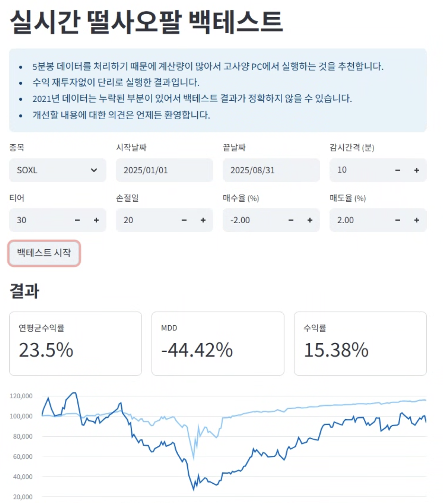

# 📈 실사오팔 백테스트

## 개요
실사오팔 파라미터를 결정하는 데 도움이 될 수 있도록 과거 데이터로 백테스트를 수행하는 프로그램을 제작했습니다.

## 특징
- 2021년부터 5분봉 데이터를 제공합니다.
- 계산량이 많아서 웹페이지에서 제공하기에는 무리가 있어서 사용자 PC에서 돌아가는 프로그램 방식으로 구현했습니다.

## 사용방법
- 종목, 시작날짜, 종료날짜, 감시 간격, 티어, 손절일, 매수율, 매도율을 입력한 후 `백테스트 시작` 버튼을 클릭합니다.
- 백세트스 완로 후 수익률, MDD, 수익률 차트가 표시됩니다.
- 계산량이 많아서 고성능 PC를 사용할 수도록 시간이 단축됩니다.

## 다운로드
[다운로드 페이지 바로가기](download_rtsop.md)
