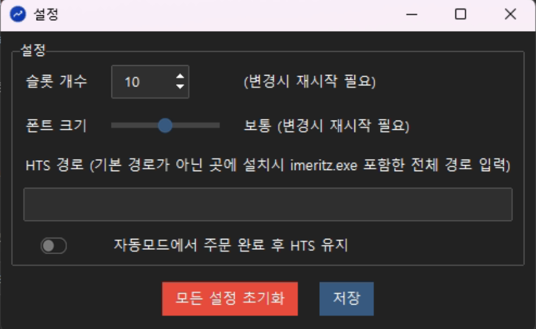

# ⚙️ 설정

설정 버튼을 클릭하면 아래와 같은 창이 열리고 다양한 설정을 할 수 있습니다.

{: style="width:500px; display:block; margin:0 auto"}

| 기능 |설명 |
|-----|----|
|슬롯 개수| ASTRA 에서는 기본적으로 5개의 슬롯을 가지고 있는데, 더 많은 슬롯이 필요할 경우에 필요한 값을 입력합니다. 저장 후 ASTRA 를 재시작해야 변경사항이 반영됩니다.|
|폰트 크기| 폰트 크기를 3단계로 설정할 수 있습니다. 폰트 크기를 변경하면 ASTRA 창 크기도 비례해서 변경이 되므로 해상도가 낮은 환경에서 유용하게 사용할 수 있습니다. 저장 후 ASTRA 를 재시작해야 변경사항이 반영됩니다.|
|HTS 경로| HTS 를 기본 경로에 설치하지 않은 경우에, 설치한 경로를 입력합니다. C드라이브 용량 문제로 다른 드라이브에 설치한 경우에 사용할 수 있습니다. `imeritz.exe` 를 포함한 전체 경로를 입력합니다.
|자동모드 HTS 유지| 자동 모드에서는 주문완료 후 HTS를 종료합니다. 하지만 주문 완료 후 확인 용도로 HTS 를 유지하고 싶을 때 이 옵션을 사용합니다.|
|모든 설정 초기화|설정 창에 있는 옵션들 및 슬롯에 입력한 모든 설정을 초기화 합니다. 저장 후 ASTRA 를 재시작해야 변경사항이 반영됩니다.| 

!!! warning 
    설정 변경 후 저장 버튼을 눌러야 반영이 됩니다.

