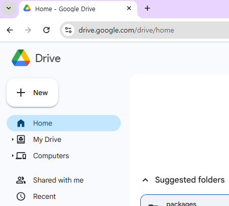
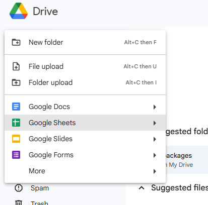
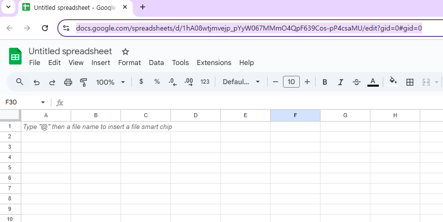
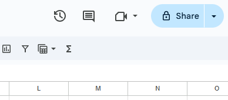
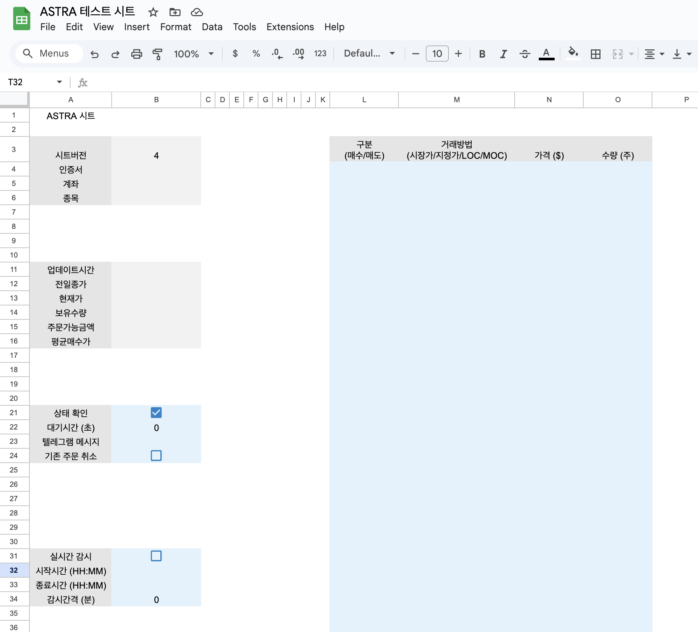

# 📊 시트매매

구글 시트에서 로직을 구성하고 매매 내역을 생성하면, Astra에서 해당 주문을 읽어서 실행하는 방식입니다.
Astra 에서는 시트 포맷만 제공하고 실제 매매법을 담은 시트는 제공하지 않습니다.
직접 제작하거나 [미국주식 퀀트투자 카페](https://cafe.naver.com/songspread)를 통해서 구하시면 됩니다.

## 1. 구글 시트 생성
구글 드라이브 사이트에서 구글 시트를 새로 생성합니다.

## 2. 시트 아이디 복사
새로 생성된 시트에서 아래 그림처럼 시트 URL을 복사한 후 Astra 프로그램의 구글시트 항목에 입력합니다.

!!! warning "주의"
    URL은 `https://` 가 포함되어 있는 형태로 입력해 주세요.

## 3. 편집 권한 부여
구글 시트에서 오른쪽 상단의 Share 버튼을 클릭한 후, Astra 계정에 편집 권한을 부여합니다. Astra 계정은 astra-sheet@astra-sheet.iam.gserviceaccount.com 입니다. 진행하면서 시트 제목이 없다고 경고가 뜰 수도 있는데, 무시해도 되고 이름을 입력해도 됩니다.

## 4. 시트 생성
Astra 프로그램 설정 영역에 시트이름과 종목을 설정한 후 설정 저장 버튼을 클릭합니다. 잠시 기다리면 아래처럼 항목이 추가가 됩니다. 옅은 회색 셀은 프로그램에서 업데이트하는 셀이며, 하늘색 셀은 사용자가 수정 가능한 설정 및 주문표입니다.

## 5. 주문 시작
주문 시작 버튼을 누르면 주문이 시작됩니다.

다음과 같은 순서로 진행이 됩니다.

1. HTS 실행
2. (상태확인 체크된 경우) 전일 종가, 현재가, 보유수량, 주문가능금액, 평균매수가 확인해서 해당 셀에 업데이트
3. (기존주문츼소 체크된 경우) 기존 주문 취소
3. (대기시간이 0보다 큰 경우) 해당 시간(초)만큼 대기
4. 주문표를 읽어서 주문 넣기 
5. 주문 내역 텔레그램 메시지 전송

## 6. 실시간 감시 기능
0.5.0 버전부터 시트에서 실시간 감시 기능이 추가 되었습니다.

주기적으로 주문표를 읽어서 주문을 넣을 수 있으며, 장중 가격을 감시해서 조건을 만족하는 경우 주문을 넣고 싶을 때 유용합니다.

| 설정 | 설명 |
|-----|-----|
|실시간 감시| 체크하면 실시간 감시가 동작합니다. |
|종료시간| 실시간 감시를 종료할 시간입니다. `HH:MM` 형식으로 입력합니다. |
|감시간격| 감시를 수행할 시간 간격입니다. 감시 후 해당 시간 만큼 대기후 다음 감시를 시작합니다. 분 단위로 입력을 해야하며, 0을 입력하면 감시 간에 대기없어 계속 감시를 수행합니다.|

