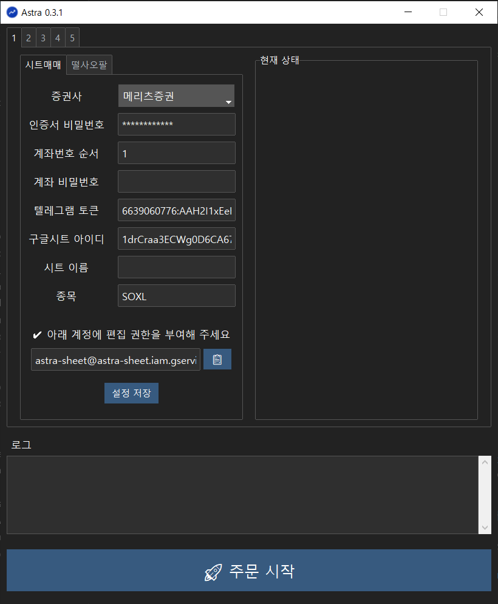
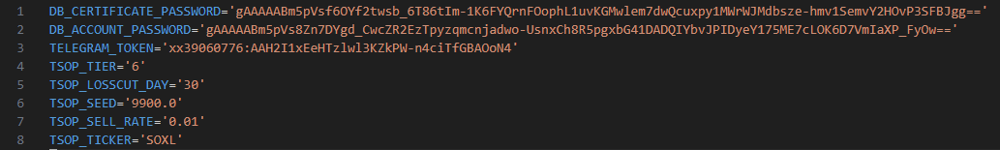

# ⭐ 공통 사용방법

## 1. 실행
astra.exe 를 실행합니다.

## 2. 설정
### 2.1. 슬롯 선택
### 2.2. 시트매매 또는 떨사오팔 탭 선택
### 2.3. 사용할 증권사 선택
### 2.4. 공인인증서 순서, 공인인증서 비밀번호, 계좌번호 순서, 계좌 비밀번호 설정 

공인인증서 순서와 계좌번호 순서는 1부터 시작합니다.

키움증권은 HTS에 계좌비밀번호를 저장하는 것이 가능하지만, DB증권과 메리츠증권은 불가능하기 때문에 프로그램에 계좌비밀번호를 등록을 해야합니다. 

암호 정보들은 보안을 위해서 다음과 같이 암호화해서 저장됩니다. (%USERPROFILE%\\.astra\\.env)

### 2.5. 텔레그램 설정

텔레그램으로 메세지를 받기 위해서는 텔레그램 토큰이 필요합니다. 아래 링크를 참고해서 봇을 생성하고 토큰을 얻을 수 있습니다. 토큰 생성까지만 하면 되고, chat id 부분은 무시해 주세요.

[텔레그램으로 봇파더 BotFather 토큰 생성하기](https://bemeal2.tistory.com/277)

위에서 생성된 토큰을 텔레그램 토큰 항목에 입력합니다. 

텔레그램 설정을 하면, 아래처럼 현재 상황에 대한 메시지를 받을 수 있습니다.

## 3. 자동매매 방법 개별 설정
자동매매 방법에 대한 소개는 각각의 페이지를 참조합니다.

[떨사오팔](tsop.md)

[시트매매](sheet.md)
